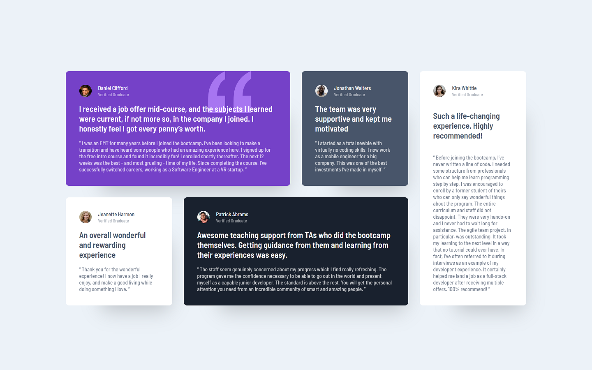

# Frontend Mentor - Testimonials grid section solution

This is a solution to the [Testimonials grid section challenge on Frontend Mentor](https://www.frontendmentor.io/challenges/testimonials-grid-section-Nnw6J7Un7). Frontend Mentor challenges help you improve your coding skills by building realistic projects. 

## Table of contents

- [Overview](#overview)
  - [The challenge](#the-challenge)
  - [Screenshot](#screenshot)
  <!-- - [Links](#links) -->
- [My process](#my-process)
  - [Built with](#built-with)
  - [What I learned](#what-i-learned)
- [Author](#author)

## Overview

### The challenge

Users should be able to:

- View the optimal layout for the site depending on their device's screen size

### Screenshot

<!-- ### Links -->

<!-- - Solution URL: [Add solution URL here](https://your-solution-url.com) -->
<!-- - Live Site URL: [Add live site URL here](https://your-live-site-url.com) -->

## My process

### Built with

- Semantic HTML5 markup
- BEM CSS classes
- CSS Grid
- Flexbox
- Mobile-first workflow

### What I learned

I began this project using Flexbox, however after some difficulty I switch to using a Grid layout with each card being a Flexbox element. While CSS Grid has many options I limited my code to only the necessary properties and adding to my classes via media queries. I also expanded on the original prompt by adding a tablet layout!

## Author

- Website - [Scott Winn](https://www.scottwinn.dev)
